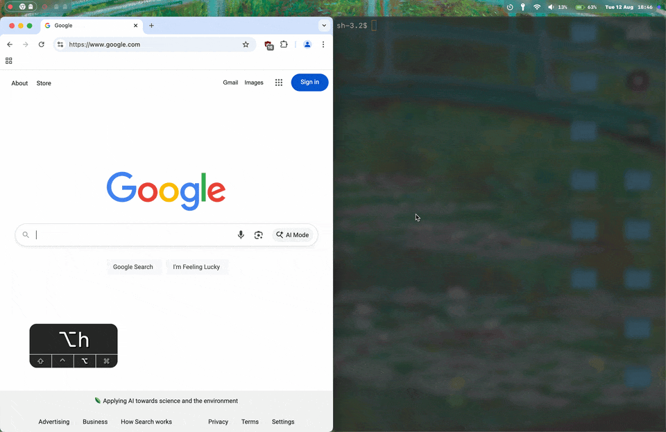

# rift

rift is a tiling window for macos. it is inspired by i3/sway/hyprland and aerospace's virtual workspace system.

### features
- smooth animations
- virtual workspaces (like [aerospace](https://github.com/nikitabobko/aerospace))
- extensive configurability (documented [here]((https://github.com/acsandmann/rift/wiki/Config))
- ipc layer that allows easily creation of custom integrations (like sketchybar or more dynamic configs)
- multiple layout systems:
	* tiling layout system(like i3/sway)
	* binary space partioning system(like bspwm)
- menubar integration that shows the state of play 
- does **NOT** require disabling of SIP for any of the features above (only wm that allows animations without disabling SIP)
- allows "displays have separate spaces" to be enabled without any issues (most/all wms ask for it to be disabled). this allows you to have a full screen app on one display whilst using the other display normally.

### motivation
aerospace worked well for me but there were a few things i missed like animations, the ability to have a full screen window on one display whilst working on the other, and more. i also disagreed with the approach of not using the private api's as the os tends to actually rely on these apis far more than the public ones so they *generally* are much more reliable and performant (and in some cases necessary due to holes in the public apis).

### usage
> [config reference](https://github.com/acsandmann/rift/wiki/Config) [quick start](https://github.com/acsandmann/rift/wiki/Quick-Start)

### status
rift is still in active development but is generally *stable*. however, there is no official release as it is still a work in progress...

### credits
rift originally began as a fork(and is licensed as such) of [glide-wm](https://github.com/glide-wm/glide) but has since diverged significantly. it uses numerous private api's which were reverse engineered by yabai and other projects. it is not affiliated with glide-wm or yabai in any way.
